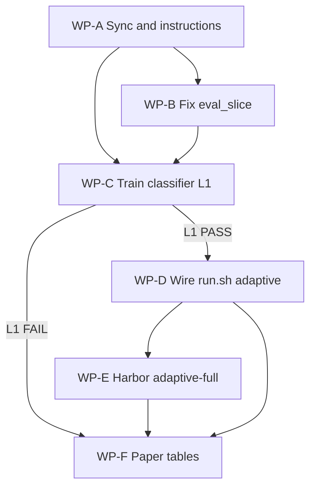

# Plan 002: Instruction-Trained Mode Router (Path to Positive Results)

> **Executor instructions**: Follow this plan step by step. Run every verification command and confirm the expected result before moving on. If a STOP condition occurs, stop and report; do not improvise. When complete, update the status row for this plan in [`plans/README.md`](./README.md).
>
> **Subagent execution**: Prefer one subagent per Work Package (WP) below. Do not start WP-C until WP-A and WP-B report PASS. Do not start WP-E (paid Harbor) until WP-C reports L1 PASS. Parent agent owns sequential gate checks.
>
> **Drift check (run first)**:
> ```bash
> git diff --stat HEAD -- \
>   benchmarks/mode_router/ \
>   benchmarks/terminal_bench_agent.py \
>   benchmarks/terminal-bench/run.sh \
>   benchmarks/terminal-bench/analyze.py \
>   benchmarks/terminal-bench/export_discordance_ledger.py \
>   paper/main.tex
> ```
> If in-scope files changed outside this plan, compare current code to the Current state section. Stop if interfaces no longer match.

## Status

- **Priority**: P0
- **Effort**: XL
- **Risk**: MED
- **Depends on**: frozen Terminal-Bench full run on GCP (`bq-tb21-full`, 88 paired tasks)
- **Category**: research / paper
- **Planned at**: 2026-08-05
- **Budget cap**: $250 new spend; ~$55 reserved for full adaptive Harbor run
- **Timeline**: 3–4 weeks

## Why this matters

Frozen Terminal-Bench shows neither static mode dominates: native **65/88 (73.9%)**, batch **58/88 (65.9%)**, McNemar **p=0.1892**. Oracle per-task mode choice reaches **72/88 (81.8%)**. That gap is the main-track uplift story.

Current `ModePolicy` heuristic reports 17/24 vs always-native 16/24 (~14% oracle-gap closure) but offline eval uses **fake instructions** (`task_id.replace("-", " ")`). Those numbers are not publication-credible. This plan: (1) sync real data, (2) train an instruction-only classifier with holdout, (3) gate at ≥40% gap closure, (4) wire Harbor adaptive only if the gate passes, (5) update paper tables from scripts.

## Current state (do not re-derive)

| Artifact | Location | State |
|---|---|---|
| Frozen full TB | GCP `bq-tb21-full`: `benchmarks/results/terminal-bench/full-frozen-82c90a4/` | 88 pairs complete; local checkout incomplete (~45 pairs) |
| Discordance ledger | GCP: `benchmarks/terminal-bench/discordance_ledger.json` | 88 tasks; missing/stale locally |
| Task instructions | `.cache/terminal-bench-2-1/tasks/<id>/instruction.md` | Commit `36d417f56c293b8271b306a0e4c566f58e98c153` |
| Mode router | [`benchmarks/mode_router/policy.py`](../benchmarks/mode_router/policy.py) | Strategies: always_native, always_batch, random, oracle, heuristic |
| Offline eval | [`benchmarks/mode_router/eval_slice.py`](../benchmarks/mode_router/eval_slice.py) line 52 | **Fake instructions — must fix** |
| Harbor agent | [`benchmarks/terminal_bench_agent.py`](../benchmarks/terminal_bench_agent.py) | `policy_strategy` supported; defaults `static` |
| Run harness | [`benchmarks/terminal-bench/run.sh`](../benchmarks/terminal-bench/run.sh) | No `adaptive` / `adaptive-full` subcommands |
| Paper table | [`paper/main.tex`](../paper/main.tex) `tab:mode_router` | Heuristic numbers from broken eval |

### Locked baselines (do not re-run)

- Full native/batch paired run: 88 tasks, frozen on GCP
- Cost basis: ~$0.57/episode
- 24-slice: all 21 discordant + 2 `both_pass` + 1 `neither_pass` (`select_stratified_slice`)
- Driver for L3: `azure-openai-responses/gpt-5.6-luna`, `thinking=high`
- Mode routing stays **in-repo**; do not fork mantis or llm-router for mode choice

### Quantitative gates

**L0 — Data integrity**

- Local ledger has 88 paired tasks matching GCP
- Every task has non-empty `instruction` from real `instruction.md`
- `eval_slice.py` has zero uses of `task_id.replace("-", " ")`

**L1 — Offline classifier (holdout / 24-slice)**

```
oracle_gap = oracle_pass_rate - always_native_pass_rate
gap_closed = (always_native_regret - policy_regret) / oracle_gap
```

**PASS** if either:

1. `gap_closed ≥ 0.40`, or
2. policy pass@1 > always_native **and** total cost ≤ always_native

**FAIL** → skip WP-E paid Harbor; go to WP-F workshop path.

**L2 — Adaptive slice reuse ($0 Harbor)**

- `run.sh adaptive` produces summary by looking up frozen outcomes for routed mode
- Adaptive pass@1 matches offline within ±1 task

**L3 — Full adaptive Harbor (only if L1 PASS)**

- 89 tasks × adaptive once; cap `BQ_MAX_MODE_ROUTER_COST_USD=55`
- Target: adaptive ≥ **68/88** pass@1 vs frozen native; report McNemar

---

## Subagent work-package map

Execute in waves. Parent verifies gate output before launching the next wave.



| WP | Subagent focus | Parallelizable with | Gate before next |
|---|---|---|---|
| **A** | Sync GCP artifacts; attach real instructions to ledger | alone first | L0 PASS |
| **B** | Fix `eval_slice.py`; re-baseline strategies | after A starts sync, can overlap once ledger has instructions | no fake instructions |
| **C** | features + train + classifier strategy + tests | after A+B | L1 PASS/FAIL report |
| **D** | `run.sh adaptive` + agent kwargs + L2 reuse eval | after L1 PASS | L2 match ±1 |
| **E** | `adaptive-full` paid Harbor on GCP | after L2 PASS | L3 metrics |
| **F** | `render_table.py` + `paper/main.tex` | after C (always); after E if L1 PASS | draft compiles |

---

## Commands you will need

| Purpose | Command | Expected on success |
|---|---|---|
| Start GCP cluster | `sky start bq-tb21-full -y` | cluster UP |
| Remote analyze | `sky exec bq-tb21-full --workdir . "PYTHONPATH=. python3 benchmarks/terminal-bench/analyze.py benchmarks/results/terminal-bench/full-frozen-82c90a4/summary.json"` | nativePass 65, batchPass 58, oracleCeilingPass 72 |
| Export ledger (remote) | `sky exec bq-tb21-full --workdir . "PYTHONPATH=. python3 benchmarks/terminal-bench/export_discordance_ledger.py benchmarks/results/terminal-bench/full-frozen-82c90a4/summary.json -o benchmarks/terminal-bench/discordance_ledger.json"` | Wrote … 88 tasks |
| Pull ledger text | `sky exec bq-tb21-full "cat benchmarks/terminal-bench/discordance_ledger.json"` then write local file | local JSON valid |
| Dataset checkout | `bash -c 'source <(sed -n "/^dataset_checkout/,/^}/p" benchmarks/terminal-bench/run.sh); ...'` or run `run.sh` path that calls `dataset_checkout` | `.cache/terminal-bench-2-1/tasks/*/instruction.md` exist |
| Attach instructions | `PYTHONPATH=. python benchmarks/mode_router/attach_instructions.py --ledger benchmarks/terminal-bench/discordance_ledger.json` | 88 instructions attached |
| Offline eval | `PYTHONPATH=. python benchmarks/mode_router/eval_slice.py --strategy classifier --strategy always_native --strategy oracle` | prints gap_closed |
| Train | `PYTHONPATH=. python benchmarks/mode_router/train_classifier.py --ledger benchmarks/terminal-bench/discordance_ledger.json --holdout-seed 42 --output benchmarks/mode_router/artifacts/classifier_v1.json` | artifact + holdout metrics |
| Unit tests | `PYTHONPATH=. python benchmarks/mode_router/test_policy.py && PYTHONPATH=. python benchmarks/mode_router/test_classifier.py` | All passed |
| Adaptive reuse | `BQ_ALLOW_PAID_ADAPTIVE=1 bash benchmarks/terminal-bench/run.sh adaptive` | `adaptive-slice-*/summary.json` |
| Adaptive full | see WP-E | 89 jobs under cost cap |
| Render table | `PYTHONPATH=. python benchmarks/mode_router/render_table.py --output paper/tables/mode_router.tex` | LaTeX rows |
| Compile paper | `cd paper && pdflatex -interaction=nonstopmode main.tex && bibtex main && pdflatex -interaction=nonstopmode main.tex && pdflatex -interaction=nonstopmode main.tex` | `main.pdf` |

---

## Scope

**In scope**

- `benchmarks/terminal-bench/sync_frozen_run.sh` (new; or documented sky sync procedure)
- `benchmarks/terminal-bench/export_discordance_ledger.py`
- `benchmarks/terminal-bench/discordance_ledger.json` (generated; commit if size OK, else private artifact + SHA in paper)
- `benchmarks/mode_router/instructions.py` (new)
- `benchmarks/mode_router/attach_instructions.py` (new)
- `benchmarks/mode_router/features.py` (new)
- `benchmarks/mode_router/train_classifier.py` (new)
- `benchmarks/mode_router/classifier.py` (new)
- `benchmarks/mode_router/policy.py`
- `benchmarks/mode_router/eval_slice.py`
- `benchmarks/mode_router/render_table.py` (new)
- `benchmarks/mode_router/test_policy.py`
- `benchmarks/mode_router/test_classifier.py` (new)
- `benchmarks/mode_router/artifacts/classifier_v1.json` (generated)
- `benchmarks/terminal_bench_agent.py`
- `benchmarks/terminal-bench/run.sh`
- `paper/main.tex`, `paper/tables/mode_router.tex`
- `plans/README.md`

**Out of scope**

- Re-running frozen native×batch full benchmark
- Second-frontier full suite (slice-only ablations only after L1 PASS, separate budget ≤$30)
- Mantis / llm-router mode routing
- Plan 001 objective evidence loop
- H1–H24 full recloud

---

## WP-A: Sync frozen artifacts and real instructions

**Owner subagent prompt sketch**: Sync `full-frozen-82c90a4` analysis + ledger from GCP; ensure TB dataset checkout; implement `instructions.py` + `attach_instructions.py`; write local `discordance_ledger.json` with instructions.

### A.1 Verify remote frozen numbers

```bash
sky start bq-tb21-full -y
sky exec bq-tb21-full --workdir . \
  "PYTHONPATH=. python3 benchmarks/terminal-bench/analyze.py \
   benchmarks/results/terminal-bench/full-frozen-82c90a4/summary.json"
```

**STOP** if `pairedTasks != 88` or `nativePass != 65` or `batchPass != 58` or `oracleCeilingPass != 72`.

### A.2 Regenerate ledger on remote; materialize locally

```bash
sky exec bq-tb21-full --workdir . \
  "PYTHONPATH=. python3 benchmarks/terminal-bench/export_discordance_ledger.py \
   benchmarks/results/terminal-bench/full-frozen-82c90a4/summary.json \
   -o benchmarks/terminal-bench/discordance_ledger.json"
```

Copy ledger JSON to the local workspace (via `sky exec … cat` → write file, or approved rsync). Prefer committing a slim ledger (task metrics + modes) and attaching instructions locally.

Also copy `summary.json` into `benchmarks/results/terminal-bench/full-frozen-82c90a4/` when network transfer is approved; until then keep analysis on GCP and ledger locally.

### A.3 Ensure dataset instructions

Use `dataset_checkout` from `run.sh` (TB commit `36d417f56c293b8271b306a0e4c566f58e98c153`). Verify:

```bash
test -f .cache/terminal-bench-2-1/tasks/count-dataset-tokens/instruction.md
```

### A.4 Create `benchmarks/mode_router/instructions.py`

```python
from pathlib import Path

TB_TASKS_ROOT = Path(".cache/terminal-bench-2-1/tasks")

def load_instruction(task_id: str) -> str:
    path = TB_TASKS_ROOT / task_id / "instruction.md"
    if not path.exists():
        raise FileNotFoundError(f"Missing instruction for {task_id}: {path}")
    return path.read_text(encoding="utf-8").strip()
```

### A.5 Create `benchmarks/mode_router/attach_instructions.py`

- Load ledger; for each task_id set `instruction = load_instruction(task_id)`
- Write ledger; print attached count
- Exit non-zero if any missing

### A.6 L0 verification

```bash
PYTHONPATH=. python benchmarks/mode_router/attach_instructions.py \
  --ledger benchmarks/terminal-bench/discordance_ledger.json
PYTHONPATH=. python -c "
import json
from pathlib import Path
d=json.loads(Path('benchmarks/terminal-bench/discordance_ledger.json').read_text())
tasks=d['tasks']
assert d['summary_metadata']['paired_tasks']==88
missing=[k for k,v in tasks.items() if not (v.get('instruction') or '').strip()]
assert not missing, missing
assert 'count-dataset-tokens' in tasks
assert 'deepseek' in tasks['count-dataset-tokens']['instruction'].lower()
print('L0 PASS', len(tasks))
"
```

**WP-A deliverable**: L0 PASS printed; ledger on disk with 88 real instructions.

---

## WP-B: Fix offline eval to use real instructions

**Owner subagent prompt sketch**: Remove fake instructions from `eval_slice.py`; add `--strategy`, `--json-out`, `gap_closed` reporting; re-baseline always_native / heuristic / oracle.

### B.1 Update `eval_slice.py`

- Import `load_instruction`
- Replace fake instruction line with:
  ```python
  instruction = info.get("instruction") or load_instruction(task_id)
  ```
- Grep the tree: `rg 'replace\\("-", " "\\)' benchmarks/mode_router` must be empty
- Add `gap_closed` vs always_native baseline in printed summary
- CLI: `--strategy` (repeatable), `--json-out PATH`

### B.2 Re-baseline (informational)

```bash
PYTHONPATH=. python benchmarks/mode_router/eval_slice.py \
  --strategy always_native --strategy always_batch --strategy heuristic --strategy oracle \
  --json-out /tmp/slice_baseline.json
```

Document numbers in commit message. Expect heuristic may worsen vs fake-instruction baseline.

**WP-B deliverable**: baseline JSON; no fake-instruction code paths.

---

## WP-C: Train instruction-only classifier (L1 gate)

**Owner subagent prompt sketch**: Implement features/train/classifier; extend ModePolicy; tests; report L1 PASS or FAIL with exact metrics. Do not start Harbor full runs.

### C.1 `features.py`

Instruction-only features (no outcomes/costs/tools/verifiers):

- `instruction_length`, `line_count`
- `supra_complexity` (reuse from `policy.py`)
- keyword buckets: compile, build, train, model, qemu, stan, debug, install, grep, find, read, count, config, test, file, directory
- TF-IDF top-50 over instruction corpus (fit on train only)

Label: `1` if `preferred_oracle_mode == "batch"` else `0`.

### C.2 `train_classifier.py`

- Train: all `both_pass` + `neither_pass` + 70% of discordant (stratified by label), seed 42
- Holdout: remaining 30% discordant (~6–7 tasks)
- Pipeline: `TfidfVectorizer(max_features=50)` + `LogisticRegression(class_weight="balanced", C=1.0)`
- Threshold tuned on train discordant subset only
- Save `benchmarks/mode_router/artifacts/classifier_v1.json` including: coefs/vocab/threshold, train_ids, holdout_ids, seed
- Print holdout accuracy, ledger-derived pass@1, regret, `gap_closed`

**STOP / L1 FAIL** if `gap_closed < 0.40` and utility clause fails. Write `/tmp/l1_gate.json` with `"verdict": "FAIL"` or `"PASS"`.

### C.3 `classifier.py` + policy strategy `"classifier"`

- Load artifact; `predict(instruction) -> {mode, score, features}`
- `ModePolicy(strategy="classifier")` delegates to classifier
- Never use `task_id` as a feature

### C.4 Tests (`test_classifier.py`)

- Holdout ∩ train = ∅
- Feature dict has no outcome keys
- Deterministic predictions for fixed artifact
- `ModePolicy("classifier")` returns native|batch only

### C.5 L1 command

```bash
PYTHONPATH=. python benchmarks/mode_router/train_classifier.py \
  --ledger benchmarks/terminal-bench/discordance_ledger.json \
  --holdout-seed 42 \
  --output benchmarks/mode_router/artifacts/classifier_v1.json \
  --gate-json /tmp/l1_gate.json

PYTHONPATH=. python benchmarks/mode_router/eval_slice.py \
  --strategy classifier --strategy always_native --strategy oracle \
  --json-out /tmp/slice_classifier.json
```

**WP-C deliverable**: `/tmp/l1_gate.json` with verdict; parent agent branches to WP-D or WP-F.

---

## WP-D: Wire Harbor adaptive (reuse path, $0)

**Owner subagent prompt sketch**: Add `adaptive` subcommand; agent loads classifier; L2 validation against offline. Do not run paid full suite.

### D.1 Agent kwargs

In `terminal_bench_agent.py`:

- Accept `policy_strategy=classifier` via Harbor `--ak`
- Load classifier artifact path from `--ak classifier_artifact=...` (default `benchmarks/mode_router/artifacts/classifier_v1.json`)
- Continue writing `/logs/agent/mode_decision.json`

### D.2 `run.sh adaptive`

- Require `BQ_ALLOW_PAID_ADAPTIVE=1`
- Select 24-slice via `select_stratified_slice`
- For each task: `ModePolicy("classifier").decide(task_id, instruction)`
- **Reuse** ledger outcomes for chosen mode (no Harbor API spend)
- Write `benchmarks/results/terminal-bench/adaptive-slice-<ts>/summary.json` compatible with `summarize.py` / `analyze.py` schema (`condition: adaptive`, plus `routedMode`)
- Log decisions to `mode-decisions.jsonl`

### D.3 L2 verification

```bash
BQ_ALLOW_PAID_ADAPTIVE=1 bash benchmarks/terminal-bench/run.sh adaptive
# compare adaptive pass count to /tmp/slice_classifier.json within ±1
```

**WP-D deliverable**: L2 PASS or report mismatch.

---

## WP-E: Full adaptive Harbor (paid; only if L1+L2 PASS)

**Owner subagent prompt sketch**: Implement `adaptive-full`; run on GCP with cost gates; analyze. Refuse if `/tmp/l1_gate.json` is FAIL.

### E.1 `run.sh adaptive-full`

- Require `BQ_ALLOW_PAID_FULL=1` and `BQ_ALLOW_PAID_ADAPTIVE=1`
- Clean git tree (same as `full`)
- Cap: `BQ_MAX_MODE_ROUTER_COST_USD` default 55
- For each of 89 tasks: Harbor run with `policy_strategy=classifier` (pre-episode tool gating)
- Resume via `BQ_RUN_DIR`; skip existing `result.json`
- Model: `BQ_MODEL=azure-openai-responses/gpt-5.6-luna`, `BQ_THINKING=high`

### E.2 Launch (GCP preferred)

```bash
sky exec bq-tb21-full --workdir . "
  export BQ_ALLOW_PAID_FULL=1 BQ_ALLOW_PAID_ADAPTIVE=1
  export BQ_MAX_MODE_ROUTER_COST_USD=55
  export BQ_MODEL=azure-openai-responses/gpt-5.6-luna
  export BQ_THINKING=high
  export BQ_RUN_DIR=benchmarks/results/terminal-bench/adaptive-full-classifier-v1
  bash benchmarks/terminal-bench/run.sh adaptive-full
"
```

Ensure Azure env vars are present on the cluster (same as frozen full run).

### E.3 Post-analysis

```bash
PYTHONPATH=. python benchmarks/terminal-bench/analyze.py <run_dir>/summary.json
```

Record adaptive pass@1, McNemar vs frozen native (join on task id), cost, regret vs oracle.

**L3 PASS**: adaptive ≥ 68/88. If below, still report numbers; do not invent significance.

**WP-E deliverable**: run dir summary + analysis JSON.

---

## WP-F: Paper tables and prose

**Owner subagent prompt sketch**: Generate LaTeX from scripts; update `main.tex`; compile PDF. If L1 FAIL, workshop autopsy framing.

### F.1 `render_table.py`

Emit rows for: always_native, always_batch, random, heuristic, classifier, oracle → `paper/tables/mode_router.tex`.

### F.2 Update `paper/main.tex`

- `\input{tables/mode_router}` for Table `tab:mode_router`
- §Adaptive Routing: real instructions, train/holdout, `gap_closed`, offline vs online
- If L3 ran: add full-benchmark adaptive row/paragraph
- If L1 FAIL: autopsy table for 7 batch-only + 14 native-only; frame routing as insufficient with instruction features alone; workshop polarity

### F.3 Compile

```bash
cd paper && pdflatex -interaction=nonstopmode main.tex && bibtex main && \
  pdflatex -interaction=nonstopmode main.tex && pdflatex -interaction=nonstopmode main.tex
```

**WP-F deliverable**: `paper/main.pdf` builds; claims match script outputs.

---

## Budget schedule

| Phase | Episodes | Est. cost |
|---|---|---|
| WP-A–D | 0 | $0 |
| WP-E full adaptive (L1 PASS only) | 89 | ~$51 |
| Optional slice ablations (after L1; separate) | ≤24 | ≤$30 |
| **Hard ceiling** | — | **$250** |

## Timeline

| Week | Deliverable | Gate |
|---|---|---|
| 1 | WP-A, WP-B, WP-C | L0 + L1 |
| 2 | WP-D; start WP-E if green | L2 |
| 3 | WP-E complete or workshop path | L3 or skip |
| 4 | WP-F paper polarity locked | PDF builds |

## Risk register

| Risk | Mitigation |
|---|---|
| Classifier overfits discordant keywords | Holdout on unseen discordant; L2 regularization |
| task_id leakage | Never use task_id as feature |
| Local/GCP artifact drift | Pin TB commit + adapter SHA in ledger metadata |
| Budget overrun | Hard caps + refuse without `BQ_ALLOW_PAID_*` |
| Fake eval regression | Grep gate forbids `replace("-", " ")` |

## Final verification checklist

- [ ] Ledger: 88 tasks with real instructions
- [ ] No fake-instruction placeholders in `mode_router/`
- [ ] `classifier_v1.json` + documented train/holdout split
- [ ] `/tmp/l1_gate.json` verdict recorded
- [ ] If PASS: `run.sh adaptive` + `adaptive-full` exist and respect cost gates
- [ ] `paper/tables/mode_router.tex` generated from scripts
- [ ] `paper/main.pdf` compiles; claims match numbers
- [ ] `plans/README.md` status → DONE or BLOCKED with reason

## Findings considered and rejected

- Forking llm-router for batch vs native: rejected — HTTP proxy cannot see tool schemas; mode decision is pre-episode tool registration.
- Using mantis Conductor as primary TB driver: rejected — unreliable DAG format; wrong routing axis.
- Re-running full native×batch for a second model before L1: rejected — cost without fixing the broken probe.
- Claiming main-track win from current 17/24 fake-instruction table: rejected — not credible.
